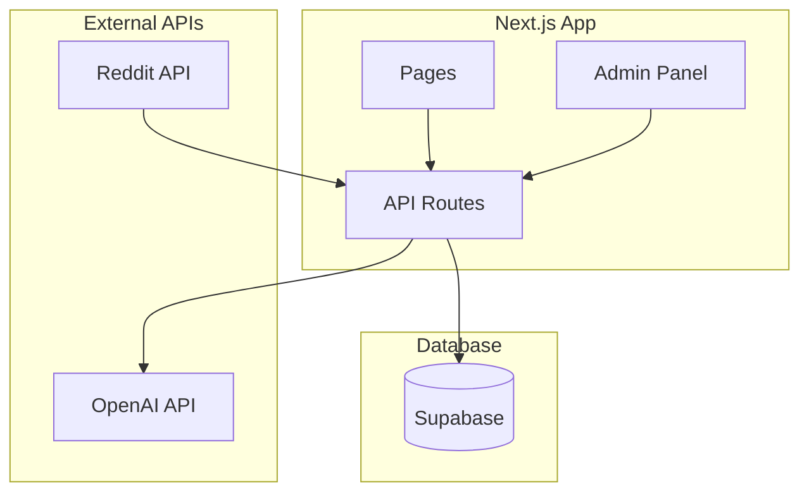

# 副业案例聚合平台 - MVP快速实现方案

**版本：** MVP 1.0  
**目标：** 48小时内完成开发部署  
**设计师：** 系统架构师  

## 🚀 快速开始指南

### ⏱️ 时间规划
- **第1天上午（4小时）**: 项目搭建 + 数据抓取
- **第1天下午（4小时）**: AI处理 + 数据存储
- **第2天上午（4小时）**: 前端展示 + 后台管理
- **第2天下午（4小时）**: 部署上线 + 测试验证

### 🎯 MVP核心功能
1. ✅ **手动抓取** - 简化自动化，手动触发即可
2. ✅ **AI结构化** - 使用OpenAI处理内容
3. ✅ **简单审核** - 基础的发布/取消发布
4. ✅ **基础展示** - 案例列表和详情页面

## 📋 技术选型（最小化依赖）

### 核心技术栈
```bash
# 前端框架
Next.js 14 (App Router)
TypeScript
Tailwind CSS

# 数据库
Supabase (免费层)

# AI服务
OpenAI API

# 部署平台
Vercel (免费层)
```

### 依赖包（最小化）
```json
{
  "dependencies": {
    "next": "14.0.0",
    "@supabase/supabase-js": "^2.38.0",
    "openai": "^4.0.0",
    "tailwindcss": "^3.3.0"
  }
}
```

## 🏗️ 简化架构设计



## 📁 项目结构（极简版）

```
sidehustle-mvp/
├── app/
│   ├── api/
│   │   ├── fetch/route.ts        # 数据抓取
│   │   ├── process/route.ts      # AI处理
│   │   └── admin/route.ts        # 管理操作
│   ├── cases/
│   │   ├── page.tsx              # 案例列表
│   │   └── [id]/page.tsx         # 案例详情
│   ├── admin/
│   │   └── page.tsx              # 管理后台
│   ├── layout.tsx                # 根布局
│   └── page.tsx                  # 首页（重定向）
├── lib/
│   ├── supabase.ts              # 数据库连接
│   ├── openai.ts                # AI服务
│   └── types.ts                 # 类型定义
├── components/
│   ├── CaseCard.tsx             # 案例卡片
│   └── AdminTable.tsx           # 管理表格
├── .env.local                   # 环境变量
└── package.json                 # 依赖配置
```

## 💾 数据库设计（单表设计）

### Supabase表结构
```sql
-- 创建案例表（MVP版本）
CREATE TABLE cases (
  id SERIAL PRIMARY KEY,
  title TEXT NOT NULL,
  description TEXT,
  income TEXT,
  time_required TEXT,
  tools TEXT,                    -- 简化为TEXT，逗号分隔
  steps TEXT,                    -- 简化为TEXT，换行分隔
  source_url TEXT,
  raw_content TEXT,
  published BOOLEAN DEFAULT false,
  created_at TIMESTAMP DEFAULT NOW()
);

-- 创建索引
CREATE INDEX idx_cases_published ON cases(published);
CREATE INDEX idx_cases_created ON cases(created_at DESC);
```

### 环境变量配置
```bash
# .env.local
NEXT_PUBLIC_SUPABASE_URL=your_supabase_url
NEXT_PUBLIC_SUPABASE_ANON_KEY=your_anon_key
SUPABASE_SERVICE_ROLE_KEY=your_service_role_key
OPENAI_API_KEY=your_openai_key
ADMIN_PASSWORD=admin123
```

## 🔧 核心实现代码

### 1. 数据库连接 (lib/supabase.ts)
```typescript
import { createClient } from '@supabase/supabase-js'

const supabaseUrl = process.env.NEXT_PUBLIC_SUPABASE_URL!
const supabaseKey = process.env.NEXT_PUBLIC_SUPABASE_ANON_KEY!
const serviceRoleKey = process.env.SUPABASE_SERVICE_ROLE_KEY!

// 前端客户端（只读已发布内容）
export const supabase = createClient(supabaseUrl, supabaseKey)

// 服务端客户端（完全访问权限）
export const supabaseAdmin = createClient(supabaseUrl, serviceRoleKey)

export interface Case {
  id: number
  title: string
  description: string
  income: string
  time_required: string
  tools: string
  steps: string
  source_url: string
  published: boolean
  created_at: string
}
```

### 2. AI处理服务 (lib/openai.ts)
```typescript
import OpenAI from 'openai'

const openai = new OpenAI({
  apiKey: process.env.OPENAI_API_KEY!
})

export async function processContent(rawContent: string): Promise<Partial<Case>> {
  const prompt = `
请将以下副业内容结构化为JSON格式：

原始内容：
${rawContent.slice(0, 2000)}

请返回JSON格式：
{
  "title": "标题（10字以内）",
  "description": "描述（50字以内）",
  "income": "收入（如：$500-1000/月 或 未知）",
  "time_required": "时间投入（如：5小时/周 或 未知）",
  "tools": "工具列表，逗号分隔",
  "steps": "步骤列表，换行分隔"
}

不要编造信息，如果原文没有则填写"未知"。
`

  try {
    const response = await openai.chat.completions.create({
      model: "gpt-3.5-turbo",
      messages: [{ role: "user", content: prompt }],
      temperature: 0.3,
    })

    const content = response.choices[0]?.message?.content
    if (!content) throw new Error('AI返回空内容')

    return JSON.parse(content)
  } catch (error) {
    console.error('AI处理失败:', error)
    throw new Error('AI处理失败')
  }
}
```

### 3. 数据抓取API (app/api/fetch/route.ts)
```typescript
import { NextResponse } from 'next/server'
import { supabaseAdmin } from '@/lib/supabase'
import { processContent } from '@/lib/openai'

// 简化版Reddit抓取
async function fetchRedditCases() {
  const response = await fetch(
    'https://www.reddit.com/r/sidehustle/hot.json?limit=10',
    { headers: { 'User-Agent': 'SideHustleBot/1.0' } }
  )
  
  const data = await response.json()
  
  return data.data.children
    .filter((post: any) => post.data.selftext.length > 100)
    .map((post: any) => ({
      title: post.data.title,
      content: post.data.selftext,
      url: `https://reddit.com${post.data.permalink}`,
      source_id: `reddit_${post.data.id}`
    }))
}

export async function POST() {
  try {
    // 1. 抓取原始数据
    const rawCases = await fetchRedditCases()
    
    // 2. AI处理 + 存储
    const processedCount = 0
    
    for (const raw of rawCases.slice(0, 3)) { // MVP限制处理3条
      try {
        // 检查是否已存在
        const { data: existing } = await supabaseAdmin
          .from('cases')
          .select('id')
          .eq('source_url', raw.url)
          .single()
        
        if (existing) continue
        
        // AI处理
        const processed = await processContent(raw.content)
        
        // 存储到数据库
        await supabaseAdmin.from('cases').insert({
          title: processed.title || raw.title,
          description: processed.description || '',
          income: processed.income || '未知',
          time_required: processed.time_required || '未知',
          tools: processed.tools || '',
          steps: processed.steps || '',
          source_url: raw.url,
          raw_content: raw.content,
          published: false
        })
        
        processedCount++
      } catch (error) {
        console.error('处理单条案例失败:', error)
      }
    }
    
    return NextResponse.json({ 
      success: true, 
      processed: processedCount 
    })
  } catch (error) {
    return NextResponse.json({ 
      success: false, 
      error: error.message 
    }, { status: 500 })
  }
}
```

### 4. 案例列表页面 (app/cases/page.tsx)
```typescript
import { supabase } from '@/lib/supabase'
import CaseCard from '@/components/CaseCard'

export default async function CasesPage() {
  const { data: cases } = await supabase
    .from('cases')
    .select('*')
    .eq('published', true)
    .order('created_at', { ascending: false })
    .limit(20)

  return (
    <div className="container mx-auto px-4 py-8">
      <h1 className="text-3xl font-bold mb-8">副业案例库</h1>
      
      <div className="grid grid-cols-1 md:grid-cols-2 lg:grid-cols-3 gap-6">
        {cases?.map((case_) => (
          <CaseCard key={case_.id} case={case_} />
        ))}
      </div>
      
      {(!cases || cases.length === 0) && (
        <div className="text-center py-12">
          <p className="text-gray-500">暂无案例，请稍后再试</p>
        </div>
      )}
    </div>
  )
}
```

### 5. 案例卡片组件 (components/CaseCard.tsx)
```typescript
import Link from 'next/link'
import { Case } from '@/lib/supabase'

interface Props {
  case: Case
}

export default function CaseCard({ case: caseData }: Props) {
  return (
    <Link href={`/cases/${caseData.id}`}>
      <div className="border rounded-lg p-6 hover:shadow-lg transition-shadow">
        <h3 className="font-semibold text-lg mb-2 line-clamp-2">
          {caseData.title}
        </h3>
        
        <p className="text-gray-600 mb-4 line-clamp-3">
          {caseData.description}
        </p>
        
        <div className="space-y-2 text-sm">
          <div className="flex justify-between">
            <span className="text-gray-500">收入:</span>
            <span className="font-medium text-green-600">
              {caseData.income}
            </span>
          </div>
          
          <div className="flex justify-between">
            <span className="text-gray-500">时间:</span>
            <span>{caseData.time_required}</span>
          </div>
        </div>
        
        {caseData.tools && (
          <div className="mt-4">
            <div className="flex flex-wrap gap-1">
              {caseData.tools.split(',').slice(0, 3).map((tool, index) => (
                <span
                  key={index}
                  className="px-2 py-1 bg-blue-100 text-blue-800 text-xs rounded"
                >
                  {tool.trim()}
                </span>
              ))}
            </div>
          </div>
        )}
      </div>
    </Link>
  )
}
```

### 6. 管理后台 (app/admin/page.tsx)
```typescript
'use client'

import { useState, useEffect } from 'react'
import { supabaseAdmin, Case } from '@/lib/supabase'

export default function AdminPage() {
  const [cases, setCases] = useState<Case[]>([])
  const [isAuthenticated, setIsAuthenticated] = useState(false)
  const [password, setPassword] = useState('')

  // 简单密码验证
  const handleLogin = () => {
    if (password === 'admin123') { // 硬编码密码（MVP版本）
      setIsAuthenticated(true)
      loadCases()
    } else {
      alert('密码错误')
    }
  }

  const loadCases = async () => {
    const { data } = await supabaseAdmin
      .from('cases')
      .select('*')
      .order('created_at', { ascending: false })
    
    setCases(data || [])
  }

  const togglePublish = async (id: number, published: boolean) => {
    await supabaseAdmin
      .from('cases')
      .update({ published: !published })
      .eq('id', id)
    
    loadCases()
  }

  const triggerFetch = async () => {
    const response = await fetch('/api/fetch', { method: 'POST' })
    const result = await response.json()
    alert(`抓取完成: ${result.processed} 条新案例`)
    loadCases()
  }

  if (!isAuthenticated) {
    return (
      <div className="container mx-auto px-4 py-8 max-w-md">
        <h1 className="text-2xl font-bold mb-4">管理后台登录</h1>
        <input
          type="password"
          value={password}
          onChange={(e) => setPassword(e.target.value)}
          placeholder="请输入密码"
          className="w-full border rounded px-3 py-2 mb-4"
          onKeyDown={(e) => e.key === 'Enter' && handleLogin()}
        />
        <button
          onClick={handleLogin}
          className="w-full bg-blue-500 text-white py-2 rounded hover:bg-blue-600"
        >
          登录
        </button>
      </div>
    )
  }

  return (
    <div className="container mx-auto px-4 py-8">
      <div className="flex justify-between items-center mb-8">
        <h1 className="text-2xl font-bold">案例管理</h1>
        <button
          onClick={triggerFetch}
          className="bg-green-500 text-white px-4 py-2 rounded hover:bg-green-600"
        >
          抓取新案例
        </button>
      </div>

      <div className="overflow-x-auto">
        <table className="w-full border-collapse border">
          <thead>
            <tr className="bg-gray-50">
              <th className="border p-2 text-left">标题</th>
              <th className="border p-2 text-left">收入</th>
              <th className="border p-2 text-left">状态</th>
              <th className="border p-2 text-left">操作</th>
            </tr>
          </thead>
          <tbody>
            {cases.map((case_) => (
              <tr key={case_.id}>
                <td className="border p-2">{case_.title}</td>
                <td className="border p-2">{case_.income}</td>
                <td className="border p-2">
                  <span className={`px-2 py-1 rounded text-sm ${
                    case_.published 
                      ? 'bg-green-100 text-green-800' 
                      : 'bg-yellow-100 text-yellow-800'
                  }`}>
                    {case_.published ? '已发布' : '待审核'}
                  </span>
                </td>
                <td className="border p-2">
                  <button
                    onClick={() => togglePublish(case_.id, case_.published)}
                    className={`px-3 py-1 rounded text-sm ${
                      case_.published
                        ? 'bg-red-500 text-white hover:bg-red-600'
                        : 'bg-blue-500 text-white hover:bg-blue-600'
                    }`}
                  >
                    {case_.published ? '取消发布' : '发布'}
                  </button>
                </td>
              </tr>
            ))}
          </tbody>
        </table>
      </div>
    </div>
  )
}
```

## 🚀 快速部署指南

### 1. 本地开发（30分钟）
```bash
# 1. 创建项目
npx create-next-app@latest sidehustle-mvp --typescript --tailwind --app

# 2. 安装依赖
cd sidehustle-mvp
npm install @supabase/supabase-js openai

# 3. 配置环境变量
cp .env.example .env.local
# 填写Supabase和OpenAI配置

# 4. 启动开发服务器
npm run dev
```

### 2. Supabase设置（15分钟）
```bash
# 1. 访问 https://supabase.com
# 2. 创建新项目
# 3. 在SQL编辑器中执行上面的表创建语句
# 4. 复制项目URL和API密钥到环境变量
```

### 3. Vercel部署（10分钟）
```bash
# 1. 推送代码到GitHub
git init
git add .
git commit -m "Initial commit"
git push

# 2. 访问 https://vercel.com
# 3. 导入GitHub仓库
# 4. 配置环境变量
# 5. 点击部署
```

## ✅ 测试验证清单

### 功能测试
- [ ] 访问首页自动跳转到 `/cases`
- [ ] 案例列表页正常显示（可能为空）
- [ ] 管理后台登录功能正常
- [ ] 手动抓取功能正常执行
- [ ] AI处理生成结构化数据
- [ ] 发布/取消发布功能正常
- [ ] 案例详情页正常显示

### 性能测试
- [ ] 页面加载时间 < 3秒
- [ ] 抓取处理时间 < 2分钟
- [ ] 数据库查询响应 < 1秒

## 🔄 MVP迭代计划

### 第1周优化
- 添加更多数据源（ProductHunt、Gumroad）
- 优化AI处理效果
- 改进UI界面

### 第2周扩展
- 添加搜索功能
- 实现自动定时抓取
- 添加SEO优化

### 第3周完善
- 用户反馈收集
- 性能优化
- 安全性增强

---

## 💡 MVP关键成功要素

1. **快速验证**: 48小时内完成基础功能
2. **用户反馈**: 尽早收集真实用户反馈
3. **数据质量**: 确保AI处理的准确性
4. **简单易用**: 界面简洁，操作简单
5. **稳定运行**: 基础功能稳定可靠

这个MVP版本去掉了复杂的架构设计，专注于核心功能的快速实现，让您能够在最短时间内验证产品概念和用户需求。