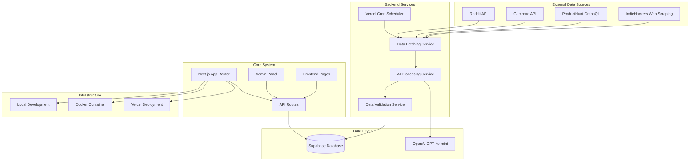
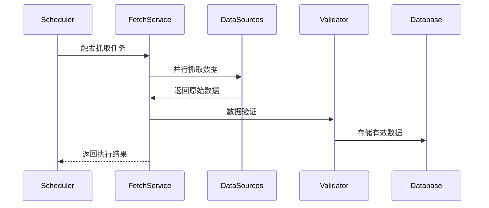
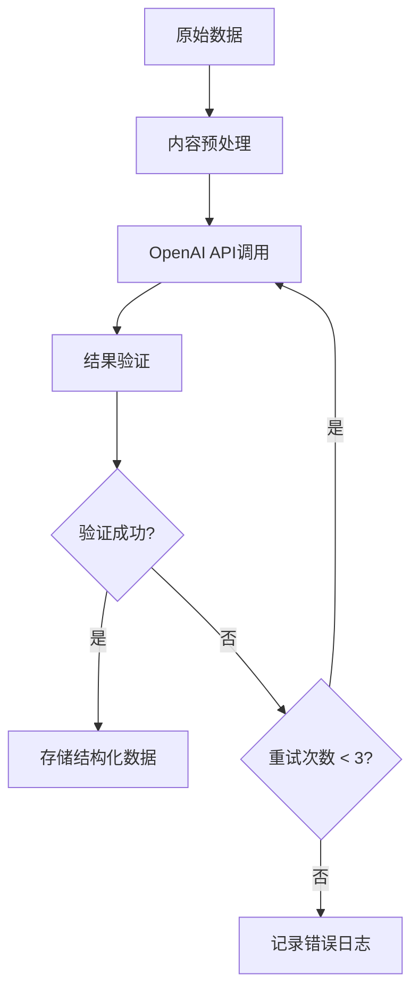

# 副业案例聚合平台 - 系统设计文档

**版本：** 1.0  
**最后更新：** 2024-09-26  
**设计师：** 系统架构师  

## 目录
1. [系统概述](#1-系统概述)
2. [架构设计](#2-架构设计)
3. [技术栈选型](#3-技术栈选型)
4. [模块详细设计](#4-模块详细设计)
5. [数据库设计](#5-数据库设计)
6. [API设计](#6-api设计)
7. [部署架构](#7-部署架构)
8. [安全设计](#8-安全设计)
9. [性能优化](#9-性能优化)
10. [监控与日志](#10-监控与日志)

## 1. 系统概述

### 1.1 系统目标
构建一个自动化的副业案例聚合平台，通过数据抓取、AI结构化处理、人工审核和前端展示，为用户提供高质量的副业案例资源。

### 1.2 核心功能
- **数据抓取**: 从Reddit、Gumroad、ProductHunt、IndieHackers等平台自动抓取副业内容
- **AI结构化**: 使用OpenAI GPT-4模型将非结构化内容转换为标准化案例
- **审核系统**: 提供后台管理界面进行内容质量审核
- **前端展示**: SEO友好的案例展示页面

### 1.3 系统特性
- 微服务架构设计
- 支持多种部署方式（本地、Docker、Vercel）
- 高可用性和可扩展性
- 完善的SEO优化
- 安全的访问控制

## 2. 架构设计

### 2.1 整体架构



### 2.2 系统分层

#### 2.2.1 表现层 (Presentation Layer)
- **前端页面**: 案例列表、详情页、SEO优化页面
- **管理后台**: 审核界面、案例管理
- **API接口**: RESTful API提供数据服务

#### 2.2.2 业务逻辑层 (Business Logic Layer)
- **数据抓取服务**: 多平台数据获取
- **AI处理服务**: 内容结构化处理
- **审核服务**: 内容质量控制
- **发布服务**: 案例发布管理

#### 2.2.3 数据访问层 (Data Access Layer)
- **数据库操作**: Supabase数据库访问
- **外部API**: 第三方平台接口调用
- **缓存管理**: 数据缓存策略

#### 2.2.4 基础设施层 (Infrastructure Layer)
- **部署平台**: Vercel/Docker部署
- **监控日志**: 系统监控和日志记录
- **安全认证**: 访问控制和权限管理

## 3. 技术栈选型

### 3.1 前端技术栈
- **框架**: Next.js 14 (App Router)
- **语言**: TypeScript
- **样式**: Tailwind CSS + shadcn/ui
- **状态管理**: React Query (TanStack Query)
- **SEO**: Next.js内置SEO优化

### 3.2 后端技术栈
- **运行时**: Node.js 18+
- **API**: Next.js API Routes (Edge Functions)
- **数据库**: Supabase (PostgreSQL)
- **AI服务**: OpenAI GPT-4o-mini
- **任务调度**: Vercel Cron

### 3.3 基础设施
- **部署**: Vercel (推荐) / Docker
- **数据库**: Supabase Cloud
- **CDN**: Vercel Edge Network
- **监控**: Vercel Analytics + 自定义日志

### 3.4 开发工具
- **包管理**: pnpm
- **代码规范**: ESLint + Prettier
- **类型检查**: TypeScript
- **测试**: Jest + Testing Library

## 4. 模块详细设计

### 4.1 数据抓取模块

#### 4.1.1 抽象数据源接口
```typescript
interface DataSource {
  name: string;
  fetchCases(): Promise<SideHustleRawItem[]>;
  validateData(item: SideHustleRawItem): boolean;
  getConfig(): SourceConfig;
}
```

#### 4.1.2 具体实现类
- **RedditSource**: Reddit API集成
- **GumroadSource**: Gumroad API集成
- **ProductHuntSource**: GraphQL API集成
- **IndieHackersSource**: 网页爬虫实现

#### 4.1.3 数据抓取流程


### 4.2 AI结构化模块

#### 4.2.1 AI处理服务
```typescript
class AIProcessingService {
  async processRawContent(raw: SideHustleRawItem): Promise<SideHustleCase> {
    // 1. 内容预处理
    // 2. OpenAI API调用
    // 3. 结果后处理
    // 4. 数据验证
  }
}
```

#### 4.2.2 Prompt工程
- **结构化Prompt模板**
- **输出格式验证**
- **错误处理机制**
- **重试策略**

#### 4.2.3 处理流程


### 4.3 审核后台模块

#### 4.3.1 认证系统
```typescript
// 简单密码认证
interface AuthService {
  login(password: string): Promise<boolean>;
  verifySession(token: string): boolean;
  generateToken(): string;
}
```

#### 4.3.2 审核界面功能
- **案例列表**: 分页显示、状态筛选
- **详情预览**: 原始内容对比
- **批量操作**: 批量发布/取消发布
- **审核日志**: 操作记录追踪

### 4.4 前端展示模块

#### 4.4.1 页面组件架构
```
pages/
├── page.tsx (重定向到/cases)
├── cases/
│   ├── page.tsx (案例列表)
│   └── [id]/
│       └── page.tsx (案例详情)
├── admin/
│   ├── page.tsx (审核后台)
│   └── login/
│       └── page.tsx (登录页)
└── sitemap.xml
```

#### 4.4.2 SEO优化策略
- **动态Meta标签生成**
- **结构化数据标记** (JSON-LD)
- **sitemap.xml自动生成**
- **robots.txt配置**
- **Open Graph支持**

## 5. 数据库设计

### 5.1 主要数据表

#### 5.1.1 side_hustle_cases表
```sql
CREATE TABLE side_hustle_cases (
  id BIGINT PRIMARY KEY GENERATED ALWAYS AS IDENTITY,
  title TEXT NOT NULL,
  description TEXT,
  income TEXT,
  time_required TEXT,
  tools TEXT[], -- PostgreSQL数组类型
  steps TEXT[], -- PostgreSQL数组类型
  source_url TEXT,
  raw_content TEXT,
  source_id TEXT UNIQUE, -- 防重复关键字段
  published BOOLEAN DEFAULT false,
  created_at TIMESTAMPTZ DEFAULT NOW(),
  updated_at TIMESTAMPTZ DEFAULT NOW()
);
```

#### 5.1.2 索引设计
```sql
-- 前端查询索引
CREATE INDEX idx_cases_published_created ON side_hustle_cases(published, created_at DESC);

-- 源ID唯一索引
CREATE UNIQUE INDEX idx_cases_source_id ON side_hustle_cases(source_id);

-- 全文搜索索引（未来扩展）
CREATE INDEX idx_cases_fulltext ON side_hustle_cases USING gin(to_tsvector('english', title || ' ' || description));
```

### 5.2 数据访问策略

#### 5.2.1 Row Level Security (RLS)
```sql
-- 启用RLS
ALTER TABLE side_hustle_cases ENABLE ROW LEVEL SECURITY;

-- 前端只能读取已发布案例
CREATE POLICY "Allow read published cases" ON side_hustle_cases
  FOR SELECT USING (published = true);

-- 后端服务可全权访问
-- 通过SERVICE_ROLE_KEY绕过RLS
```

#### 5.2.2 数据访问层设计
```typescript
class CaseRepository {
  // 前端访问：仅已发布案例
  async getPublishedCases(limit: number, offset: number): Promise<SideHustleCase[]>
  
  // 后端访问：全部案例
  async getAllCases(): Promise<SideHustleCase[]>
  
  // 审核操作
  async updatePublishStatus(id: number, published: boolean): Promise<void>
}
```

## 6. API设计

### 6.1 RESTful API规范

#### 6.1.1 公开API (前端使用)
```
GET /api/cases                    # 获取已发布案例列表
GET /api/cases/[id]              # 获取单个案例详情
GET /sitemap.xml                 # 站点地图
GET /robots.txt                  # 爬虫协议
```

#### 6.1.2 内部API (后端使用)
```
POST /api/ingest/fetch-cases     # 手动触发数据抓取
POST /api/ingest/process-ai      # AI处理队列
```

#### 6.1.3 管理API (后台使用)
```
POST /api/admin/login            # 管理员登录
GET /api/admin/cases             # 获取所有案例（含未发布）
PUT /api/admin/cases/[id]/publish # 发布/取消发布案例
```

### 6.2 API响应格式

#### 6.2.1 成功响应
```typescript
interface ApiResponse<T> {
  success: true;
  data: T;
  pagination?: {
    total: number;
    page: number;
    limit: number;
  };
}
```

#### 6.2.2 错误响应
```typescript
interface ApiError {
  success: false;
  error: {
    code: string;
    message: string;
    details?: any;
  };
}
```

### 6.3 限流策略
- **公开API**: 每IP每分钟100请求
- **管理API**: 每session每分钟30请求
- **抓取API**: 每小时1次执行

## 7. 部署架构

### 7.1 Vercel部署（推荐）

#### 7.1.1 部署配置
```json
{
  "functions": {
    "app/api/ingest/fetch-cases/route.ts": {
      "maxDuration": 300
    }
  },
  "crons": [
    {
      "path": "/api/ingest/fetch-cases",
      "schedule": "0 2 * * 1"
    }
  ]
}
```

#### 7.1.2 环境变量配置
```bash
# Supabase配置
NEXT_PUBLIC_SUPABASE_URL=https://xxx.supabase.co
NEXT_PUBLIC_SUPABASE_ANON_KEY=eyJhb...
SUPABASE_SERVICE_ROLE_KEY=eyJhb...

# AI服务配置
OPENAI_API_KEY=sk-xxxx

# 第三方API
PH_API_TOKEN=ph_abc123

# 系统配置
ADMIN_PASSWORD=mysecretpass
NEXT_PUBLIC_SITE_URL=https://sidehustle.example.com
```

### 7.2 Docker部署

#### 7.2.1 Dockerfile优化
```dockerfile
FROM node:18-alpine AS base

FROM base AS deps
WORKDIR /app
COPY package.json pnpm-lock.yaml ./
RUN corepack enable pnpm && pnpm install --frozen-lockfile

FROM base AS builder
WORKDIR /app
COPY --from=deps /app/node_modules ./node_modules
COPY . .
RUN corepack enable pnpm && pnpm build

FROM base AS runner
WORKDIR /app
RUN addgroup --system --gid 1001 nodejs
RUN adduser --system --uid 1001 nextjs

COPY --from=builder /app/public ./public
COPY --from=builder --chown=nextjs:nodejs /app/.next/standalone ./
COPY --from=builder --chown=nextjs:nodejs /app/.next/static ./.next/static

USER nextjs
EXPOSE 3000
ENV PORT 3000

CMD ["node", "server.js"]
```

#### 7.2.2 容器编排
```yaml
version: '3.8'
services:
  sidehustle-app:
    build: .
    ports:
      - "3000:3000"
    environment:
      - NODE_ENV=production
    env_file:
      - .env.production
    restart: unless-stopped
    healthcheck:
      test: ["CMD", "curl", "-f", "http://localhost:3000/api/health"]
      interval: 30s
      timeout: 10s
      retries: 3
```

### 7.3 本地开发环境

#### 7.3.1 开发环境搭建
```bash
# 环境要求
node --version  # >= 18.17
pnpm --version  # >= 8.0

# 项目设置
cp .env.example .env.local
pnpm install
pnpm dev
```

#### 7.3.2 开发工具配置
```json
{
  "scripts": {
    "dev": "next dev",
    "build": "next build",
    "start": "next start",
    "lint": "next lint",
    "test": "jest",
    "test:watch": "jest --watch",
    "type-check": "tsc --noEmit"
  }
}
```

## 8. 安全设计

### 8.1 访问控制

#### 8.1.1 前端安全
- **ANON_KEY**: 仅读取已发布内容
- **RLS策略**: 数据库级别访问控制
- **HTTPS强制**: 生产环境强制SSL

#### 8.1.2 后台安全
- **密码认证**: 环境变量存储管理密码
- **Session管理**: JWT token有效期控制
- **CSRF防护**: SameSite Cookie设置

#### 8.1.3 API安全
- **密钥轮换**: 定期更新API密钥
- **限流保护**: 防止API滥用
- **输入验证**: 严格的参数校验

### 8.2 数据安全

#### 8.2.1 敏感信息保护
```typescript
// 环境变量验证
const requiredEnvVars = [
  'SUPABASE_SERVICE_ROLE_KEY',
  'OPENAI_API_KEY',
  'ADMIN_PASSWORD'
];

requiredEnvVars.forEach(envVar => {
  if (!process.env[envVar]) {
    throw new Error(`Missing required environment variable: ${envVar}`);
  }
});
```

#### 8.2.2 数据传输安全
- **HTTPS加密**: 所有数据传输加密
- **API密钥隐藏**: 客户端不暴露敏感密钥
- **请求签名**: 关键API请求签名验证

## 9. 性能优化

### 9.1 前端性能

#### 9.1.1 Next.js优化
```typescript
// ISR配置
export const revalidate = 3600; // 1小时重新验证

// 图片优化
import Image from 'next/image';

// 代码分割
const AdminPanel = dynamic(() => import('./AdminPanel'), {
  loading: () => <p>Loading...</p>,
});
```

#### 9.1.2 缓存策略
- **静态生成**: 案例详情页预生成
- **增量静态再生**: 定期更新静态页面
- **CDN缓存**: Vercel Edge Network加速

### 9.2 后端性能

#### 9.2.1 数据库优化
```sql
-- 查询优化
EXPLAIN ANALYZE SELECT * FROM side_hustle_cases 
WHERE published = true 
ORDER BY created_at DESC 
LIMIT 20;

-- 连接池配置
max_connections = 100
shared_buffers = 256MB
effective_cache_size = 1GB
```

#### 9.2.2 API优化
- **并发处理**: 数据抓取并行执行
- **批量操作**: 减少数据库往返次数
- **异步处理**: AI处理异步执行

### 9.3 监控指标
- **响应时间**: API响应时间监控
- **错误率**: 错误率告警设置
- **资源使用**: CPU/内存使用监控
- **数据库性能**: 慢查询监控

## 10. 监控与日志

### 10.1 日志系统

#### 10.1.1 结构化日志
```typescript
interface LogEntry {
  timestamp: string;
  level: 'info' | 'warn' | 'error';
  service: string;
  action: string;
  details: Record<string, any>;
  correlationId?: string;
}

class Logger {
  static info(action: string, details: Record<string, any>) {
    console.log(JSON.stringify({
      timestamp: new Date().toISOString(),
      level: 'info',
      service: 'sidehustle-platform',
      action,
      details
    }));
  }
}
```

#### 10.1.2 关键事件日志
- **数据抓取**: 成功/失败数量、处理时间
- **AI处理**: 成功率、失败原因
- **用户行为**: 页面访问、搜索查询
- **系统错误**: 异常堆栈、上下文信息

### 10.2 监控告警

#### 10.2.1 关键指标监控
```typescript
// 抓取任务监控
const fetchMetrics = {
  totalFetched: 0,
  successCount: 0,
  errorCount: 0,
  averageProcessTime: 0
};

// 告警阈值
const alertThresholds = {
  errorRate: 0.1,        // 错误率 > 10%
  responseTime: 5000,    // 响应时间 > 5s
  aiProcessingFail: 0.2  // AI处理失败率 > 20%
};
```

#### 10.2.2 健康检查
```typescript
// /api/health
export async function GET() {
  const healthChecks = await Promise.allSettled([
    checkDatabase(),
    checkOpenAI(),
    checkExternalAPIs()
  ]);
  
  const isHealthy = healthChecks.every(
    result => result.status === 'fulfilled'
  );
  
  return Response.json({
    status: isHealthy ? 'healthy' : 'unhealthy',
    checks: healthChecks
  });
}
```

### 10.3 运维自动化

#### 10.3.1 自动恢复机制
- **重试策略**: 指数退避重试
- **熔断器**: 防止级联故障
- **降级服务**: 关键功能保障

#### 10.3.2 数据备份
- **Supabase自动备份**: 每日数据备份
- **配置备份**: 环境变量备份
- **代码仓库**: Git版本控制

---

## 附录

### A. 项目目录结构
```
sidehustle-platform/
├── app/                          # Next.js App Router
│   ├── api/                      # API Routes
│   │   ├── admin/               # 管理API
│   │   ├── cases/               # 案例API
│   │   └── ingest/              # 数据抓取API
│   ├── cases/                   # 案例页面
│   ├── admin/                   # 管理后台
│   ├── globals.css              # 全局样式
│   ├── layout.tsx               # 根布局
│   └── page.tsx                 # 首页
├── components/                   # 可复用组件
│   ├── ui/                      # UI组件库
│   ├── CaseCard.tsx             # 案例卡片
│   └── CaseDetail.tsx           # 案例详情
├── lib/                         # 工具库
│   ├── sources/                 # 数据源实现
│   ├── ai/                      # AI处理
│   ├── database/                # 数据库操作
│   └── utils/                   # 工具函数
├── types/                       # TypeScript类型定义
├── public/                      # 静态资源
├── .env.example                 # 环境变量示例
├── Dockerfile                   # Docker配置
├── docker-compose.yml           # 容器编排
├